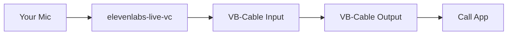

# elevenlabs-live-vc (fork — low-latency chunked streaming)

> **This is a modified fork of [cavoq/elevenlabs-live-vc](https://github.com/cavoq/elevenlabs-live-vc).**
> The original project records a full utterance before uploading. This fork adds a
> **chunked streaming mode** that continuously sends audio to ElevenLabs while you are
> still speaking, cutting perceived latency from ~30 s down to ~7 s for typical speech.
> All original modes are preserved and work unchanged.

[](https://github.com/cavoq/elevenlabs-live-vc/actions/workflows/build.yml)

```
Live speech to speech bot using Eleven Labs API.

██╗     ██╗██╗   ██╗███████╗    ██╗   ██╗ ██████╗
██║     ██║██║   ██║██╔════╝    ██║   ██║██╔════╝
██║     ██║██║   ██║█████╗█████╗██║   ██║██║
██║     ██║╚██╗ ██╔╝██╔══╝╚════╝╚██╗ ██╔╝██║
███████╗██║ ╚████╔╝ ███████╗     ╚████╔╝ ╚██████╗
╚══════╝╚═╝  ╚═══╝  ╚══════╝      ╚═══╝   ╚═════╝

Description: A live voice-changer utilizing elevenlabs voice-cloning API.
Original author: https://github.com/cavoq
```

## What this fork changes

| | Original | This fork |
|---|---|---|
| Upload trigger | Recording stops | Every N seconds while speaking |
| Playback stream | Created/destroyed per request | Persistent — no gaps between chunks |
| Perceived latency | utterance length + ~2.8 s | ~2.8 s after first chunk (typically < 7 s) |
| `optimize_streaming_latency` | Not exposed | Configurable via env var |
| Latency metrics | First-chunk time only | Per-chunk breakdown + rolling averages |

### How chunked mode works

```
Mic → [AudioRecorder]
         │  every CHUNK_DURATION_SECONDS seconds
         ▼
      chunk_queue  ←─────────────────────────────────────┐
         │                                               │
         ▼                                        (still recording)
  [Upload Worker thread]
         │
         ▼
  ElevenLabs STS API
         │  streamed response
         ▼
  [Persistent OutputStream]  →  VB-Cable / output device
```

The microphone never stops. Each chunk is uploaded as soon as it is cut, so ElevenLabs
starts processing chunk 1 while chunk 2 is still being recorded.

---

## Features

- **Real-time Voice Transformation** - Transform your voice using ElevenLabs' AI voice cloning
- **VB-Cable Integration** - Routes transformed audio to VB-Cable for use in calls
- **Three Recording Modes**:
  - **Manual (MODE=0)** - Press SPACE to start/stop recording
  - **Automatic (MODE=1)** - Voice Activity Detection auto-detects speech
  - **Chunked streaming** - Overlay on MODE=0 or MODE=1 via `CHUNK_DURATION_SECONDS`
- **Per-chunk latency dashboard** - Console output with rolling averages
- **Configurable Audio Settings** - Sample rate, channels, silence threshold, noise reduction

## Use Cases

- Discord voice calls with voice changing
- Zoom/Teams meetings
- WhatsApp calls (via WhatsApp Desktop)
- Streaming with OBS
- Any application that supports microphone input

## Prerequisites

1. **ElevenLabs Account** - Get your API key from [ElevenLabs](https://elevenlabs.io/app/settings/api-keys)
2. **VB-Cable** - Download and install from [https://vb-audio.com/Cable/](https://vb-audio.com/Cable/)
3. **FFmpeg** - Required for audio processing. Download from [https://ffmpeg.org/download.html](https://ffmpeg.org/download.html)
4. **Python 3.12.x or 3.13.x** (3.13.12 recommended) - Download from [https://python.org](https://python.org)
5. **uv (optional, recommended)** - Install from [https://docs.astral.sh/uv/](https://docs.astral.sh/uv/)

## Installation

### 1. Clone the repository

```bash
git clone https://github.com/cavoq/elevenlabs-live-vc.git
cd elevenlabs-live-vc
```

### 2. Install dependencies

#### Option A: uv (recommended)

```bash
uv python install 3.13.12
uv venv --python 3.13.12
uv sync
```

#### Option B: pip

```bash
pip install -r requirements.txt
```

### 3. Environment Variables

Create a file named `.env` in the root directory:

```env
# Required
API_KEY=your_elevenlabs_api_key_here
VOICE_ID=your_voice_id_here

# Optional - Audio settings
SAMPLE_RATE=48000
CHANNELS=1
SILENCE_THRESHOLD=0.01
VAD_THRESHOLD=0.01
REMOVE_BACKGROUND_NOISE=1
OUTPUT_SAMPLE_RATE=48000
API_SAMPLE_RATE=22050
# OUTPUT_DEVICE=5
# OUTPUT_DEVICE_NAME=VB-Cable
# INPUT_DEVICE=2
# INPUT_DEVICE_NAME=Microphone

# Optional - VAD (Automatic mode)
VAD_SILENCE_DURATION=0.8
VAD_MIN_RECORDING_DURATION=0.3
VAD_PRE_BUFFER_DURATION=0.5

# Optional - Recording mode (0=Manual, 1=VAD)
MODE=0

# Optional - Chunked low-latency streaming (this fork)
# CHUNK_DURATION_SECONDS=4      # seconds per chunk; 0 = disabled (original behavior)
# CHUNK_OVERLAP_SECONDS=0       # overlap between chunks (future use)
# OPTIMIZE_STREAMING_LATENCY=4  # ElevenLabs latency hint 0-4 (4 = most aggressive)
```

## Usage

### Start the Application

```bash
# uv
uv run python live-vc.py

# plain Python
python live-vc.py
```

### Manual Mode (Default, `MODE=0`)

1. Press **SPACE** to start recording
2. Speak into your microphone
3. Press **SPACE** again to stop and process

### Automatic Mode (`MODE=1`)

1. Just speak — recording starts automatically
2. Silence is detected and processing triggers
3. Listening resumes automatically

### Chunked Streaming Mode

Add to `.env`:

```env
CHUNK_DURATION_SECONDS=4
OPTIMIZE_STREAMING_LATENCY=4
```

Works alongside `MODE=0` or `MODE=1`. While you speak, audio is split every 4 seconds
and sent to ElevenLabs immediately. You will hear the first converted output in ~7 s
while the rest of your speech continues to be processed in the background.

Console output per chunk:

```
[Chunk #1] queued (187 frames)
[Chunk #1] uploading...
[Chunk #1] Capture→First-audio: 6821ms | Upload delay: 42ms | EL latency: 2784ms
  Rolling avg (n=1) | First-chunk: 2784ms | Queue delay: 42ms
```

### Commands

| Command | Description |
|---------|-------------|
| `set_mode 0` | Switch to manual mode |
| `set_mode 1` | Switch to automatic mode (VAD) |
| `get_mode` | Show current mode |
| `clear` | Clear the screen |
| `quit` | Exit the application |

## Using with Call Applications

### Setup for Discord/Zoom/WhatsApp/etc.

1. Install VB-Cable
2. Run the voice changer: `uv run python live-vc.py`
3. In your call app go to Settings → Audio/Voice
4. Set Microphone/Input to **"CABLE Output"**

### Audio Flow



## Docker

```bash
docker build -t el-live-vc .
docker run --env-file .env -it --privileged -v /dev/input:/dev/input el-live-vc
```

## Troubleshooting

### "No audio recorded" message

- Speak for at least 0.5 seconds
- Check microphone is set as default input device
- Verify microphone permissions

### VB-Cable not detected

- Ensure VB-Cable is installed correctly
- The app looks for a device containing "CABLE Input" in the name
- Restart the app after installing VB-Cable

### Voice not heard in call apps

- Select **"CABLE Output"** as the microphone in your call app
- Check VB-Cable is not muted in system sound settings

### API Errors

- Verify your API key in `.env`
- Check your ElevenLabs account has credits
- Ensure the Voice ID exists and you have access to it

### Chunked mode: gaps or overlap in playback

- Reduce `CHUNK_DURATION_SECONDS` (e.g. `3`) if queue backlog builds
- Increase `OPTIMIZE_STREAMING_LATENCY` (max `4`) to lower ElevenLabs processing time
- Verify only one output device is active (`OUTPUT_DEVICE` or `OUTPUT_DEVICE_NAME`)

## Configuration Reference

| Variable | Default | Description |
|----------|---------|-------------|
| `API_KEY` | required | ElevenLabs API key |
| `VOICE_ID` | required | Target voice ID |
| `SAMPLE_RATE` | 48000 | Mic capture sample rate (Hz) |
| `CHANNELS` | 1 | Audio channels (1 = mono) |
| `SILENCE_THRESHOLD` | 0.01 | Silence trim threshold (RMS) |
| `VAD_THRESHOLD` | 0.01 | Voice detection threshold (RMS) |
| `REMOVE_BACKGROUND_NOISE` | 1 | 1=Enable, 0=Disable |
| `OUTPUT_SAMPLE_RATE` | 48000 | Playback device sample rate (Hz) |
| `API_SAMPLE_RATE` | 22050 | ElevenLabs PCM output rate (Hz) |
| `OUTPUT_DEVICE` | — | Output device index |
| `OUTPUT_DEVICE_NAME` | — | Output device name substring |
| `INPUT_DEVICE` | — | Input device index |
| `INPUT_DEVICE_NAME` | — | Input device name substring |
| `VAD_SILENCE_DURATION` | 0.8 | Seconds of silence before auto-stop |
| `VAD_MIN_RECORDING_DURATION` | 0.3 | Minimum recording length (s) |
| `VAD_PRE_BUFFER_DURATION` | 0.5 | Pre-buffer duration (s) |
| `MODE` | 0 | 0=Manual, 1=VAD |
| `CHUNK_DURATION_SECONDS` | 0 | Chunk size in seconds; 0 = disabled |
| `CHUNK_OVERLAP_SECONDS` | 0 | Chunk overlap (future use) |
| `OPTIMIZE_STREAMING_LATENCY` | 4 | ElevenLabs latency hint (0–4) |

## License

GNU General Public License v3.0 - See [LICENSE](LICENSE) for details.

## Credits

- **Original author**: [cavoq](https://github.com/cavoq)
- **Additional contributors**: [ayeantics](https://github.com/ayeantics)
- **Fork modifications**: chunked streaming pipeline, persistent playback stream, latency metrics
- **ElevenLabs**: [https://elevenlabs.io](https://elevenlabs.io)
- **VB-Audio**: [https://vb-audio.com](https://vb-audio.com)
